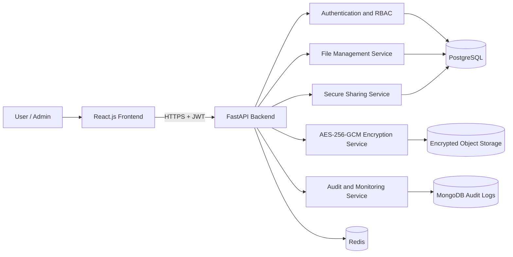

# TrustShare System Architecture

## 1. Overview

TrustShare is a secure file-sharing and digital collaboration platform. Users can upload, organize, and share files through controlled permissions and temporary share links.

The system uses React.js for the frontend, FastAPI for backend APIs, PostgreSQL for core data, encrypted object storage for files, and Docker for consistent development and deployment.

## 2. Technology Stack

| Layer | Technology | Purpose |
|---|---|---|
| Frontend | React.js + Vite | User interface |
| Backend | Python + FastAPI | REST APIs, business logic, security controls |
| Primary Database | PostgreSQL | Users, files, folders, permissions, share links |
| Audit Logs | MongoDB | Security events and activity logs |
| Cache / Rate Limiting | Redis | Temporary data, rate limits, token controls |
| File Storage | Local storage / AWS S3 / Azure Blob | Encrypted file storage |
| Containerization | Docker + Docker Compose | Consistent development and deployment |

## 3. High-Level Request Flow

1. A user accesses the React.js web application.
2. The frontend sends HTTPS requests to the FastAPI backend.
3. FastAPI authenticates the user using JWT tokens.
4. FastAPI checks roles, ownership, and file permissions.
5. File metadata is stored in PostgreSQL.
6. Uploaded files are encrypted using AES-256-GCM before storage.
7. Only encrypted files are saved in object storage.
8. Security events are recorded in audit logs.

## 4. High-Level Architecture Diagram

## 5. Component Responsibilities

### React.js Frontend

- Registration and login screens
- File upload and file-management dashboard
- Folder and file browsing
- Share-link creation
- Notifications and analytics views

### FastAPI Backend

- Validates API requests
- Authenticates users
- Enforces roles and file permissions
- Encrypts and decrypts files
- Manages share links and expiration
- Records security and activity logs

### PostgreSQL

Stores users, folders, file metadata, permissions, share links, and download records.

### Object Storage

Stores encrypted file data only. Original files must never be permanently stored without encryption.

### Docker

Runs the frontend, backend, database, and supporting services consistently across environments.

## 6. Production Design Principles

- HTTPS for all communication
- Secrets stored in environment variables or a secrets manager
- Files encrypted before storage
- Encryption keys never exposed to users
- Backend authorization for every protected request
- Database migrations for schema changes
- Centralized logging and audit trails